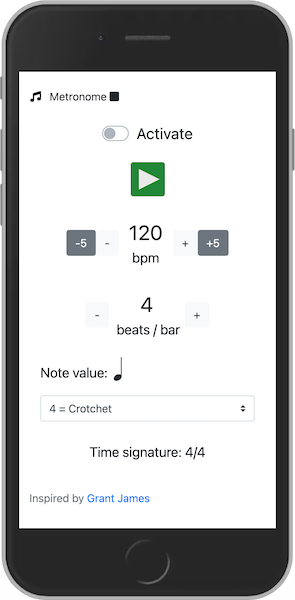

# About
A simple metronome written using Javascript and the Web Audio API. 

This implementation is available as part of the   [Hi-Audio online platform](https://hiaudio.fr)—an open-source, collaborative browser-based DAW—providing a practical demonstration of its applicability and integration in real-world web audio environments.

This repository is an adpatation from [Grant james](https://github.com/grantjames/metronome) to add time signature and also to include a worker to handle the time interval as in [Chris Wilson](https://github.com/cwilso/metronome/)

## How to run it locally:

Requirement: Node.js

1. `git clone https://github.com/gilpanal/metronome.git`
2. `cd metronome`
3. `npm i`
4. `npm start`
5. Navigate to `localhost:8080`