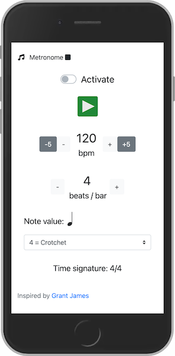

# Metronome


A browser-based metronome built with vanilla JavaScript and the Web Audio API. It supports configurable time signatures, note durations, and uses a Web Worker to decouple the scheduling timer from the main thread — ensuring precise beat timing regardless of UI activity.

A live demo is available at [gilpanal.github.io/metronome](https://gilpanal.github.io/metronome/).

This project is also integrated into [Hi-Audio](https://hiaudio.fr), an open-source, collaborative browser-based DAW.

## Repository Documents

| File | Purpose |
|---|---|
| [README.md](README.md) | Developer guide for the standalone app (this file) |
| [HI-AUDIO.md](HI-AUDIO.md) | Integration guide for the Hi-Audio host environment — lifecycle, exported API, known limitations |
| [ROADMAP.md](ROADMAP.md) | Prioritised issue backlog and improvement plan, intended to become GitHub issues |



---

## Table of Contents

- [Repository Documents](#repository-documents)
- [Scope](#scope)
- [Known Limitations](#known-limitations)
- [Architecture](#architecture)
- [Project Structure](#project-structure)
- [Core Concepts](#core-concepts)
- [Getting Started](#getting-started)
- [Development Workflow](#development-workflow)
- [Configuration](#configuration)
- [Browser Compatibility](#browser-compatibility)
- [Contributing](#contributing)
- [Credits](#credits)
- [Citation](#citation)
- [License](#license)

---

## Scope

This is a focused, standalone metronome — not a general-purpose audio framework. It is intentionally small: a single scheduling engine, a minimal UI, and a Web Worker timer. The goal is to remain easy to understand, embed, and adapt. Features that would push it toward a full DAW component (complex automation, MIDI I/O, plugin architecture) are out of scope here and belong in the host environment such as Hi-Audio.

**Standalone vs Hi-Audio UI boundary:** the audio engine (`metronome.js`) is mirrored line-for-line in Hi-Audio and kept in sync manually, but the UI integration layer is not shared — `metronomehandler.js` in Hi-Audio maintains its own copy of the UI wiring. Behaviour changes to the engine may require a coordinated update downstream. See [HI-AUDIO.md](HI-AUDIO.md) for details.

---

## Known Limitations

These are known gaps in the current implementation. They are documented in [ROADMAP.md](ROADMAP.md) as planned work.

- **`activate` is visual-only** — toggling the Activate switch changes the icon colour but does not silence audio output. `scheduleNote()` fires unconditionally regardless of the flag value.
- **`notesInQueue` is never pruned** — every scheduled beat is pushed onto the `notesInQueue` array and never removed. This causes slow unbounded growth over long sessions.
- **Worker is stopped but not terminated** — `postMessage('stop')` halts the timer interval but `timerWorker.terminate()` is never called. The worker thread stays alive for the lifetime of the page. This matters more in host integrations than in the standalone app.
- **No automated tests** — there is currently no test suite. The scheduling logic and time signature formula are the most important targets for a first test layer.

---

## Architecture

The application is split into three files with clear, non-overlapping responsibilities:

```
┌─────────────────────────────────────────────────────────┐
│  Browser Main Thread                                    │
│                                                         │
│  ┌──────────────┐        ┌───────────────────────────┐  │
│  │   app.js     │ uses   │      metronome.js          │  │
│  │  (UI layer)  │───────▶│  (audio engine + state)   │  │
│  └──────────────┘        └───────────┬───────────────┘  │
│                                      │ postMessage       │
└──────────────────────────────────────┼──────────────────┘
                                       │
                          ┌────────────▼────────────┐
                          │   metronomeworker.js     │
                          │   (Web Worker thread)    │
                          │   setInterval → 'tick'   │
                          └─────────────────────────┘
```

- **`app.js`** — Initializes the `Metronome` instance, wires up DOM event listeners, and reacts to UI changes (tempo, beats per bar, note duration, play/pause, activation toggle). Has no audio logic.
- **`metronome.js`** — Owns the `AudioContext`, the lookahead scheduler, and all Web Audio API calls. Exposes a small public API (`init`, `start`, `stop`, `startStop`) and two UI callbacks (`callback_start`, `callback_stop`).
- **`metronomeworker.js`** — A minimal Web Worker whose only job is to fire `'tick'` messages at a fixed interval using `setInterval`. Running in a separate thread means the main thread being busy (layout, JavaScript execution) cannot delay the tick.

---

## Project Structure

```
metronome/
├── .github/
│   └── workflows/
│       └── deploy.yml          # CI: build and deploy to GitHub Pages on push to master
├── src/                        # Vite root — all source assets live here
│   ├── index.html              # Single-page app entry point
│   ├── style.css               # Minimal custom styles
│   ├── Bravura.otf             # SMuFL-compliant music notation font
│   └── js/
│       ├── app.js              # UI layer: event handlers and DOM updates
│       ├── metronome.js        # Audio engine: Metronome class
│       └── metronomeworker.js  # Web Worker: independent timer loop
├── dist/                       # Production build output (generated, not committed)
├── doc/
│   └── screenshot_small.png
├── vite.config.js
├── package.json
├── HI-AUDIO.md                 # Hi-Audio platform integration guide
├── ROADMAP.md                  # Prioritised issue backlog and improvement plan
├── LICENSE
└── README.md
```

---

## Core Concepts

### Lookahead Scheduling

Calling Web Audio API scheduling directly from `setTimeout` or `setInterval` on the main thread produces timing drift because JavaScript timers are not real-time and can be delayed by garbage collection, layout, or other main-thread work.

This project uses the technique described by Chris Wilson: a **Web Worker fires a tick every 25 ms** (the `lookahead` interval). On each tick, the main thread's `scheduler()` function runs and **pre-schedules all notes that will occur within the next 100 ms** (`scheduleAheadTime`) using `AudioContext.currentTime` as the reference clock. Because `AudioContext` time is driven by the audio hardware, it is not affected by main-thread delays.

```
Worker tick (every 25ms)
        │
        ▼
scheduler() on main thread
        │
        └─ while nextNoteTime < audioContext.currentTime + 0.1
               scheduleNote(beat, time)   ← precise hardware-clock time
               nextNote()                 ← advance internal state
```

The two parameters that control this tradeoff are in `metronome.js`:

| Property | Default | Effect |
|---|---|---|
| `lookahead` | `25` ms | How often the worker ticks. Lower = more CPU, tighter maximum drift. |
| `scheduleAheadTime` | `0.1` s | How far ahead notes are pre-scheduled. Must be large enough to cover the worker tick interval (i.e. > `lookahead` / 1000 seconds). |

### Beat and Time Signature

The time signature is represented as two independent values:

- **`beatsPerBar`** — the numerator (how many beats per bar, 1–50)
- **`noteDuration`** — the denominator (note value of each beat: 1, 2, 4, 8, or 16)

The duration of one beat in seconds is:

```
secondsPerBeat = (60 / tempo) * (4 / noteDuration)
```

The `4 /` factor normalises any note value relative to a quarter note. For example, at 120 BPM:

- Quarter note (4): `(60/120) * (4/4)` = 0.5 s
- Eighth note (8): `(60/120) * (4/8)` = 0.25 s

### Audio Synthesis

Each beat is a short oscillator click synthesised directly with the Web Audio API — no audio files are required:

```
Beat 0 (downbeat): 1000 Hz oscillator
Other beats:        800 Hz oscillator

Envelope:
  gain 1.0 at t+0.001 s  (near-instant attack)
  gain 0.001 at t+0.020 s (exponential decay — 20 ms click)
  oscillator stops at t+0.030 s
```

The gain node uses `exponentialRampToValueAtTime` to avoid clicks from abrupt amplitude changes.

### Synchronized Start

`start(startTime)` accepts an optional `startTime` (in seconds) that can represent a position in a larger timeline — for example, the playhead position of a host DAW. The method calculates which beat within the current bar corresponds to that position, so the metronome snaps into phase with an external transport rather than always starting at beat 0.

```js
const secondsPerBeat = (60 / tempo) * (4 / noteDuration)
const beatsElapsed    = Math.floor(startTime / secondsPerBeat)
currentBeatInBar      = beatsElapsed % beatsPerBar
nextNoteTime          = audioContext.currentTime + 0.05 - (startTime % (secondsPerBeat * beatsPerBar))
```

### Music Notation Font

Beat duration symbols in the UI are rendered using **Bravura**, an open-source font compliant with the Standard Music Font Layout (SMuFL). Unicode code points used:

| Symbol | Note value | Code point |
|---|---|---|
| 𝅝 | Whole (1) | `U+E1D2` |
| 𝅗𝅥 | Half (2) | `U+E1D3` |
| 𝅘𝅥 | Quarter (4) | `U+E1D5` |
| 𝅘𝅥𝅮 | Eighth (8) | `U+E1D7` |
| 𝅘𝅥𝅯 | Sixteenth (16) | `U+E1D9` |

---

## Getting Started

### Prerequisites

- **Node.js** ≥ 18 (LTS recommended)
- **npm** ≥ 9

### Install and run

```bash
git clone https://github.com/gilpanal/metronome.git
cd metronome
npm install
npm start
```

Open [http://localhost:8080/metronome/](http://localhost:8080/metronome/) in a browser that supports the Web Audio API and Web Workers (all modern browsers do).

> Note: Vite serves the app under `/metronome/` (not bare `/`) because `vite.config.js` sets `base: "/metronome/"` to match the GitHub Pages deployment path.

---

## Development Workflow

| Command | Description |
|---|---|
| `npm start` | Start Vite dev server at `localhost:8080` with HMR |
| `npm run build` | Production build — outputs hashed assets to `dist/` |
| `npm run preview` | Serve the production build locally for final verification |

Deployment is automated via GitHub Actions — pushing to `master` triggers the workflow at `.github/workflows/deploy.yml`, which builds the project and publishes it to GitHub Pages.

### How Vite handles the Web Worker

Vite bundles `metronomeworker.js` as a separate chunk. The worker is loaded in `metronome.js` using the Vite-compatible pattern:

```js
new Worker(new URL('metronomeworker.js', import.meta.url), { type: 'module' })
```

This works in both dev (native ES module worker) and production (Vite rewrites the URL to the hashed chunk).

### Adding a new note duration

1. Add the numeric denominator value to the `<select>` in `src/index.html`.
2. Add the corresponding SMuFL code point to the `notes_duration_symbols` map in `src/js/app.js`.
3. No changes to `metronome.js` are required — `noteDuration` is used generically in the formula.

### Changing the click sound

The oscillator parameters are in `scheduleNote()` in `src/js/metronome.js`:

- `osc.frequency.value` — pitch in Hz
- `exponentialRampToValueAtTime` times — controls click duration and sharpness
- `osc.stop(time + 0.03)` — maximum click length

To use a sampled sound instead of a synthesised one, replace the oscillator/gain nodes with an `AudioBufferSourceNode` loaded from a decoded audio file.

---

## Configuration

`vite.config.js` contains the settings most likely to need changes:

```js
export default {
  root: 'src',         // Directory Vite serves as the web root
  build: {
    outDir: '../dist'  // Where the production build is written
  },
  base: '/metronome/', // URL base path — change this if deploying to a different subpath
  server: {
    port: 8080
  }
}
```

If you fork this repo and deploy to a different GitHub Pages URL (e.g. `https://yourname.github.io/my-metronome/`), update `base` to `/my-metronome/`.

---

## Browser Compatibility

The application depends on two browser APIs:

| API | Notes |
|---|---|
| **Web Audio API** | All modern browsers. `window.webkitAudioContext` fallback included for older Safari. |
| **Web Workers** | All modern browsers. Required — there is no fallback timer. |
| **ES Modules in Workers** | Chrome 80+, Firefox 114+, Safari 15+. Vite's production build avoids this requirement by bundling the worker. |

> **AudioContext autoplay policy:** Browsers require a user gesture before an `AudioContext` can produce sound. The play button in the UI satisfies this requirement — `AudioContext` is created on first play, not on page load.

---

## Contributing

Contributions are welcome. The prioritised backlog is in [ROADMAP.md](ROADMAP.md) — check there first to see what is already planned or under discussion.

Some areas where improvements would be valuable:

- **Visual beat indicator** — the `@keyframes blink` animation in `style.css` is stubbed out; a proper visual pulse synchronized to the audio would improve usability.
- **Subdivision support** — scheduling subdivisions (triplets, dotted notes) within each beat.
- **AudioWorklet migration** — replacing the Worker + lookahead pattern with an `AudioWorkletProcessor` for even tighter scheduling, at the cost of broader setup complexity.
- **Tests** — there are currently no automated tests. Unit tests for the scheduling logic (mocking `AudioContext`) and the time signature formula would be a good starting point.

Before opening a pull request:

- Open an issue first so the approach can be discussed before significant work is done.
- Be aware that the audio engine (`metronome.js`) is also used in Hi-Audio. Behaviour changes to the engine may require a coordinated update downstream. See [HI-AUDIO.md](HI-AUDIO.md) for context.

---

## Credits

- **Scheduling architecture** — inspired by [Chris Wilson's metronome](https://github.com/cwilso/metronome/) and his article [A Tale of Two Clocks](https://web.dev/articles/audio-scheduling).
- **Base implementation** — adapted from [Grant James' metronome](https://github.com/grantjames/metronome), extended with time signature support and Web Worker scheduling.
- **Bravura font** — [SMuFL-compliant music notation font](https://www.smufl.org/) by Steinberg.
- **Hi-Audio platform** — [hiaudio.fr](https://hiaudio.fr), the open-source browser-based DAW where this metronome is integrated.

---

## Citation

If you use this project or the Hi-Audio platform in academic work, please cite:

```bibtex
@article{GilPanal2026,
  author  = {Gil Panal, Jos{\'e} M. and David, Aur{\'e}lien and Richard, Ga{\"e}l},
  title   = {The Hi-Audio online platform for recording and distributing multi-track music datasets},
  journal = {Journal on Audio, Speech, and Music Processing},
  year    = {2026},
  issn    = {3091-4523},
  doi     = {10.1186/s13636-026-00459-0},
  url     = {https://doi.org/10.1186/s13636-026-00459-0}
}
```

---

## License

This project is licensed under the [MIT License](LICENSE).
